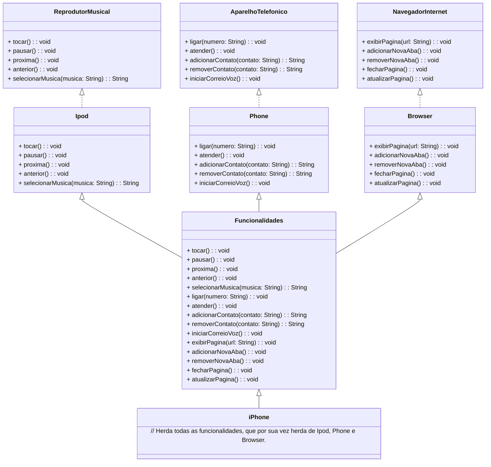

# Desafio POO

# Resumo do Diagrama UML do Componente iPhone

## Visão Geral
O diagrama UML representa as principais funcionalidades do componente iPhone, incluindo o Reprodutor Musical, Aparelho Telefônico e Navegador na Internet.

## Elementos Principais

### Reprodutor Musical
- Representado pela classe `ReprodutorMusical`, este componente possui métodos para tocar, pausar, avançar e retroceder músicas, além de selecionar uma música específica para reprodução.

### Aparelho Telefônico
- Representado pela classe `AparelhoTelefonico`, este componente possui métodos para fazer ligações, atender chamadas, adicionar e remover contatos, e iniciar correio de voz.

### Navegador na Internet
- Representado pela classe `NavegadorInternet`, este componente possui métodos para exibir páginas da web, adicionar novas abas, remover abas existentes, fechar páginas e atualizar páginas.

### iPhone
- Representado pela classe `iPhone`, este componente herda todas as funcionalidades do Reprodutor Musical, Aparelho Telefônico e Navegador na Internet, encapsulando todas as funcionalidades do dispositivo.

## Objetivo
- Criar um diagrama UML que represente as funcionalidades do iPhone descritas no [Desfio POO](https://github.com/digitalinnovationone/trilha-java-basico/tree/main/desafios/poo) e com base no vídeo do [Lançamento do iPhone](https://www.youtube.com/watch?v=9ou608QQRq8).

## Diagrama UML (Mermaid)

## Referências
- Repositório do instrutor Gleyson Sampaio [GitHub](https://github.com/digitalinnovationone/trilha-java-basico/tree/main/desafios/poo)
- [Material de Apoio](https://glysns.gitbook.io/java-basico/programacao-orientada-a-objetos/conceito-de-poo)
- BootCamp Santander - [DIO](http://www.dio.me/)
